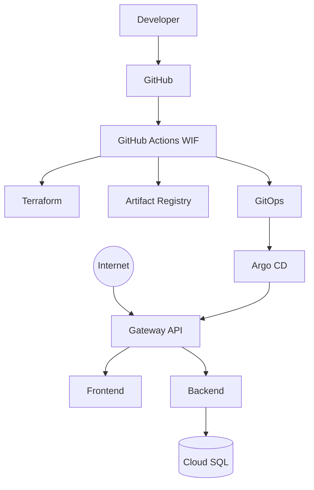

# GCP 3-Tier Platform (`myapp`)

Production-oriented reference implementation:

**Terraform → GKE + Cloud SQL + Artifact Registry → GitHub Actions (OIDC/WIF) → GitOps → Argo CD → Gateway API → React + Go → Private PostgreSQL**

## Status: Phases 1–14 complete

| Phase | Name | Status |
|-------|------|--------|
| 1 | Architecture and Design | Complete |
| 2 | Terraform Bootstrap | Complete |
| 3 | Networking | Complete |
| 4 | GKE | Complete |
| 5 | Cloud SQL | Complete |
| 6 | Artifact Registry | Complete |
| 7 | Application | Complete |
| 8 | Gateway API | Complete |
| 9 | GitHub Actions | Complete |
| 10 | Argo CD | Complete |
| 11 | Observability | Complete |
| 12 | Security hardening | Complete |
| 13 | Documentation | Complete |
| 14 | End-to-end validation | **Complete** |

---

## Validate

```bash
# Static (no GCP apply required)
./scripts/validate-all.sh dev

# After infrastructure + DNS + images
./scripts/validate-gcp.sh dev
./scripts/smoke-test.sh dev https://dev.myapp.example.com
```

Consistency review: [docs/phase-14/consistency-review.md](docs/phase-14/consistency-review.md)  
Final tree: [docs/phase-14/final-tree.md](docs/phase-14/final-tree.md)  
Go-live checklist: [docs/production-readiness.md](docs/production-readiness.md)

---

## Architecture



## Documentation map

Full index: [docs/README.md](docs/README.md)

| Topic | Doc |
|-------|-----|
| Architecture | [docs/architecture.md](docs/architecture.md) |
| Networking / CIDRs | [docs/networking.md](docs/networking.md) |
| Security | [docs/security.md](docs/security.md) |
| Terraform | [docs/terraform.md](docs/terraform.md) |
| CI/CD | [docs/cicd.md](docs/cicd.md) · [docs/phase-9/cicd.md](docs/phase-9/cicd.md) |
| GitOps / Argo CD | [docs/gitops.md](docs/gitops.md) · [docs/phase-10/argocd.md](docs/phase-10/argocd.md) |
| Database | [docs/database.md](docs/database.md) |
| Monitoring | [docs/monitoring.md](docs/monitoring.md) |
| DR / Rollback / Cost | [docs/disaster-recovery.md](docs/disaster-recovery.md) · [docs/rollback.md](docs/rollback.md) · [docs/cost-optimization.md](docs/cost-optimization.md) |
| Troubleshooting | [docs/troubleshooting.md](docs/troubleshooting.md) |

## Quick start

1. `terraform/bootstrap` → state + WIF  
2. `terraform/environments/dev` apply  
3. Configure GitHub Actions variables  
4. Enable Argo CD + External Secrets  
5. Delegate DNS; push images; smoke test  

## Production readiness checklist

```text
[ ] Terraform state secured
[ ] GCP APIs enabled
[ ] VPC / PSA / NAT / Firewall
[ ] Private GKE + Workload Identity
[ ] Artifact Registry
[ ] Cloud SQL private IP + HA/PITR (stage/prod)
[ ] Secret Manager + External Secrets
[ ] GitHub OIDC / WIF
[ ] CI + container/terraform scanning
[ ] GitOps + Argo CD
[ ] Gateway API + HTTPS + DNS
[ ] Monitoring + logging + alerts
[ ] NetworkPolicies + Pod Security
[ ] DR + rollback documented
[ ] Smoke test passed
```
