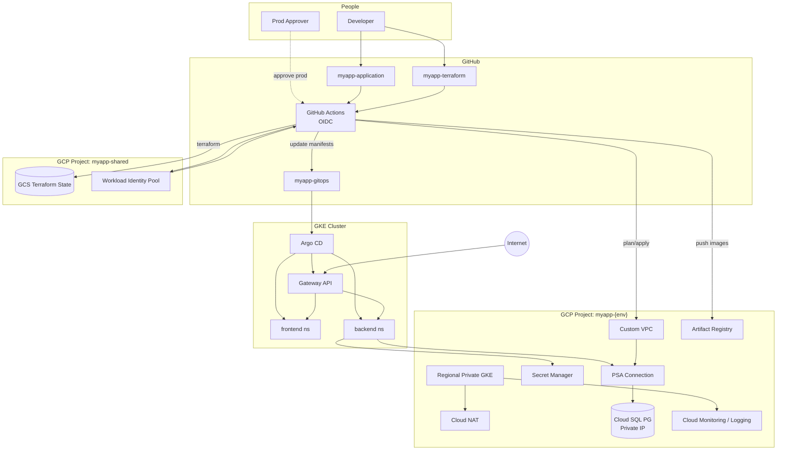
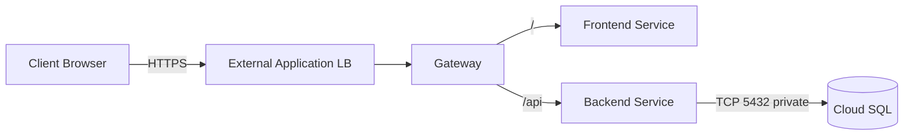
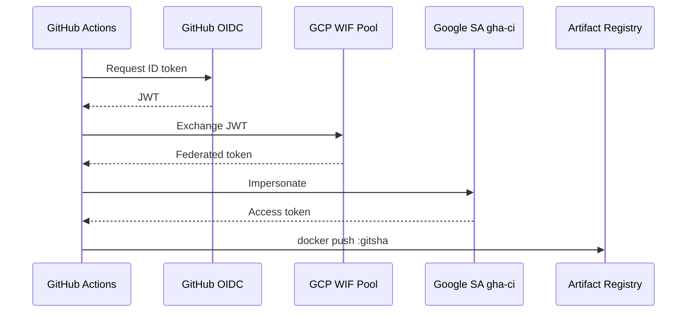
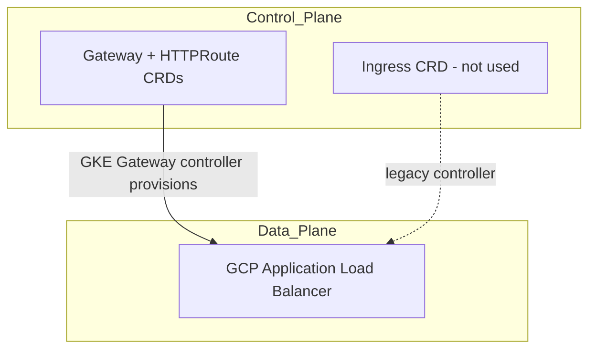

# Architecture Diagrams (Phase 1)

## End-to-end platform

## Network data path

## Identity path for CI

## Gateway API vs Ingress vs Load Balancer

| Layer | What it is |
|-------|------------|
| Load Balancer | Actual Google Front End / URL map / backends / NEGs |
| Ingress | Older Kubernetes API that often maps 1:1 to an LB via annotations |
| Gateway API | Newer role-oriented API; this design’s L7 entry point |
